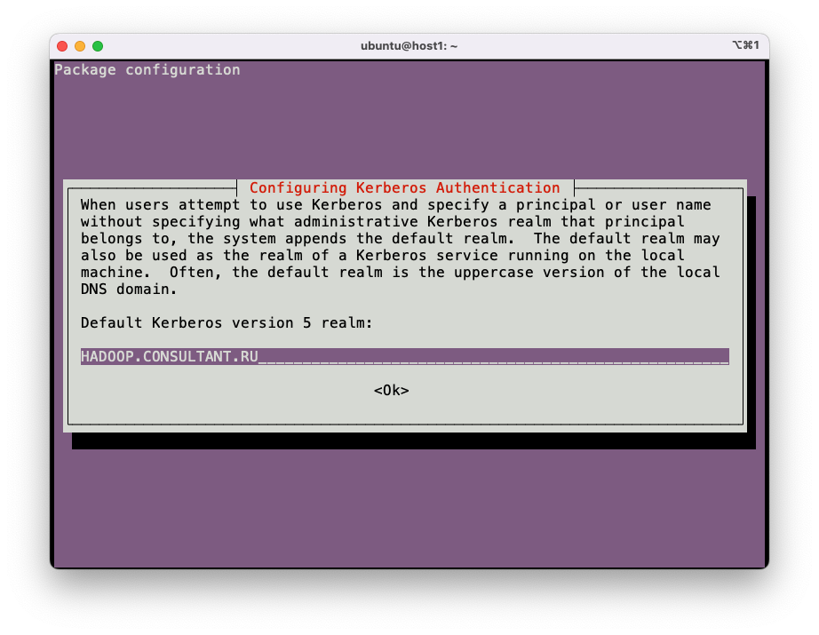
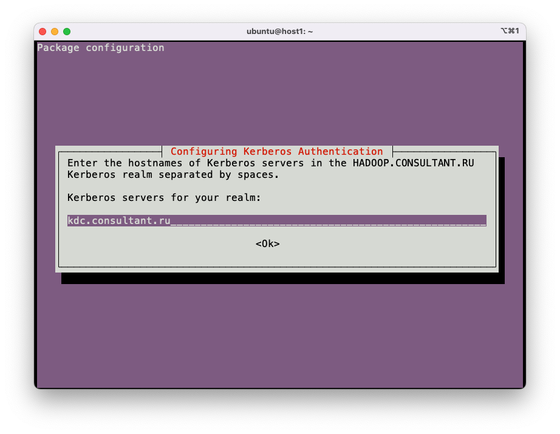
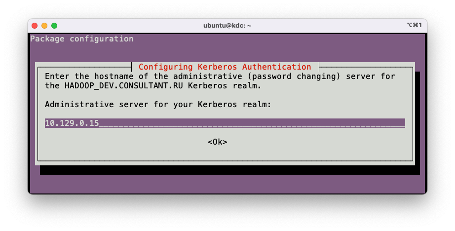
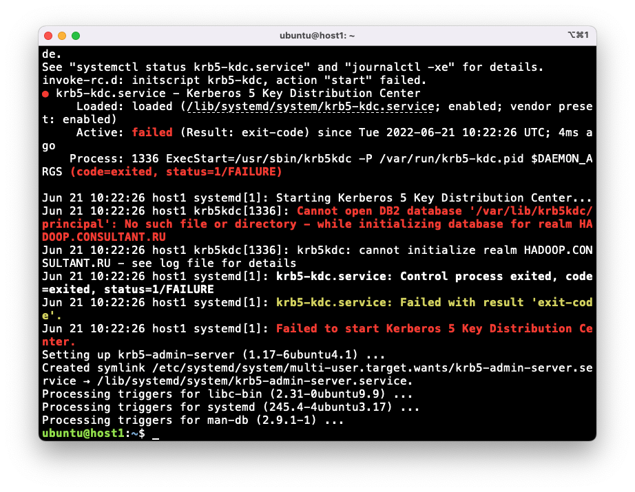

# Настройка Kerberos

## Настройка KDC

### Установка и первичная настройка

```bash
sudo apt update
sudo apt install -y krb5-kdc krb5-admin-server
```





Выскочит ошибка. Это нормально.  


```bash
sudo krb5_newrealm
# Придумать и ввести пароль от базы данных.
```

```bash
sudo kadmin.local
# Создать пользователя-админа (подставить имя вместо <your_name>). Придумать и ввести пароль.
addprinc <your_name>/admin
quit
```

Добавить строку в **/etc/krb5kdc/kadm5.acl**:

```
<your_name>/admin      *
```

```bash
sudo systemctl restart krb5-admin-server
```

Проверить, что всё работает:

```bash
kinit <your_name>/admin
klist
```

### Создание пользователей

Логинимся как админ

```bash
kinit <your_name>/admin
klist
```

#### Стандартный способ

Создаем по пользователю для каждой пары сервис/хост.
Для каждого нового пользователя вводим пароль.

```bash
kadmin

addprinc hdfs-dev1/hadoop-master.consultant.ru
addprinc hdfs-dev1/hadoop-slave1.consultant.ru
addprinc hdfs-dev1/hadoop-slave2.consultant.ru
addprinc hdfs-dev1/hadoop-slave3.consultant.ru

addprinc yarn-dev1/hadoop-master.consultant.ru
addprinc yarn-dev1/hadoop-slave1.consultant.ru
addprinc yarn-dev1/hadoop-slave2.consultant.ru
addprinc yarn-dev1/hadoop-slave3.consultant.ru

addprinc mapred-dev1/hadoop-master.consultant.ru
addprinc mapred-dev1/hadoop-slave1.consultant.ru
addprinc mapred-dev1/hadoop-slave2.consultant.ru
addprinc mapred-dev1/hadoop-slave3.consultant.ru

addprinc hbase-dev1/hadoop-master.consultant.ru
addprinc hbase-dev1/hadoop-slave1.consultant.ru
addprinc hbase-dev1/hadoop-slave2.consultant.ru
addprinc hbase-dev1/hadoop-slave3.consultant.ru

# HTTP - имя пользователя-сервиса, участвующего в SPNEGO-аутентификации.
addprinc HTTP-dev1/hadoop-master.consultant.ru
addprinc HTTP-dev1/hadoop-slave1.consultant.ru
addprinc HTTP-dev1/hadoop-slave2.consultant.ru
addprinc HTTP-dev1/hadoop-slave3.consultant.ru

# Следующие сервисы разворачиваются только на hadoop-master
addprinc spark-dev1/hadoop-master.consultant.ru
addprinc hive-dev1/hadoop-master.consultant.ru

quit
```

#### Автоматизированный способ

Копируем файл [addprinc.sh](../scripts/addprinc.sh) на kdc-сервер.

```bash
./addprinc.sh hadoop-{master,slave1,slave2,slave3}.consultant.ru
# Скрипт запросит переменные
admin password: <пароль от kerberos-пользователя "your_name/admin">
realm: SERVICE

Service: hdfs-dev1
Password:
Service: yarn-dev1
Password:
Service: mapred-dev1
Password:
Service: hbase-dev1
Password:
Service: HTTP
Password:
# Для остановки цикла нажимаем Ctrl+C

./addprinc.sh hadoop-master.consultant.ru
admin password:
realm: SERVICE

Service: spark-dev1
Password:
Service: hive-dev1
Password:
# Ctrl+C
```

## Настройка хостов

Kerberos на хостах настраивается автоматически.

## Проверка работоспособности HDFS

Когда HDFS запущена в Secure Mode, следующие команды должны выполняться без ошибок:

```bash
# [hdfs-dev1@hadoop-master.consultant.ru]
kinit $(whoami)/$(hostname -f) -kt /etc/security/krb5.keytab
curl -i --negotiate -u : "http://host1.consultant.ru:$DFS_NAMENODE_HTTP_PORT/webhdfs/v1/?op=LISTSTATUS"
```

А следующая команда должна вернуть ошибку аутентификации:

```bash
# [hdfs-dev1@hadoop-master.consultant.ru]
kinit $(whoami)/$(hostname -f) -kt /etc/security/krb5.keytab
curl -i "http://host1.consultant.ru:$DFS_NAMENODE_HTTP_PORT/webhdfs/v1/?op=LISTSTATUS"
```

## Настройка Windows

1. Получить логин и пароль от Kerberos.
2. Скачать и установить Kerberos Ticket Manager: [ссылка](https://web.mit.edu/kerberos/dist/kfw/4.1/kfw-4.1-amd64.msi).
3. Создать файл `C:\ProgramData\MIT\Kerberos\krb5.ini` со следующим содержимым:

```ini
[libdefaults]
  default_realm = HADOOP_DEV.CONSULTANT.RU

[realms]
  HADOOP_DEV.CONSULTANT.RU = {
    admin_server = hadoop-master.consultant.ru
    kdc = hadoop-master.consultant.ru
  }
```

4. Скачать и установить браузер Firefox.
5. Открыть Firefox. Прописать в адресной строке `about:config`.
6. Установить следующие значения для параметров:

```
network.negotiate-auth.delegation-uris  =  http://hadoop-master.consultant.ru
network.negotiate-auth.trusted-uris     =  http://hadoop-master.consultant.ru
network.auth.use-sspi                   =  false
```

7. Перезагрузить компьютер.
8. Запустить Kerberos Ticket Manager. Нажать **Get Ticket**. Ввести логин и пароль от Kerberos. Нажать **OK**.
9. Убедиться, что всё работает, открыв [hadoop-master.consultant.ru:9870](hadoop-master.consultant.ru:9870).
