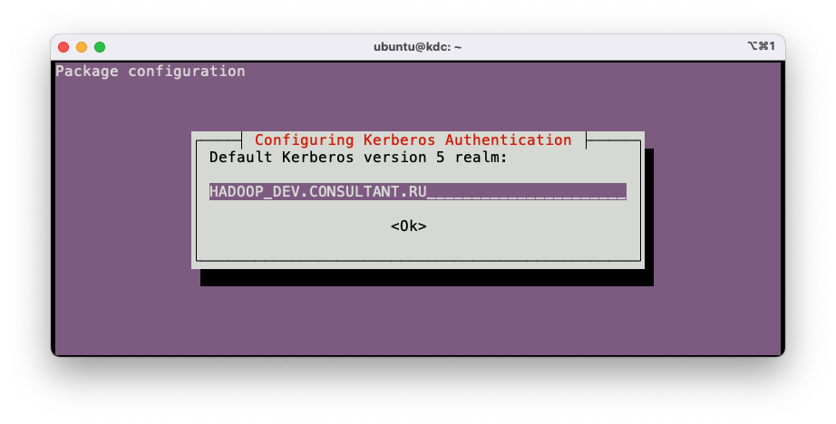
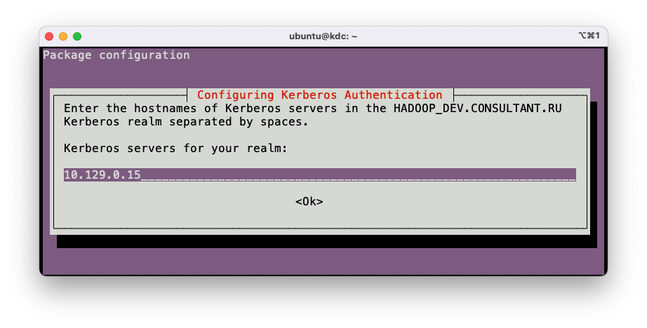

# Настройка Kerberos

## Настройка KDC

### Установка и первичная настройка

```bash
sudo apt update
sudo apt-get install -y krb5-kdc krb5-admin-server
```





Выскочит ошибка. Это нормально.  


```bash
sudo krb5_newrealm
# Придумать и ввести пароль от базы данных.
```

```bash
sudo kadmin.local
# Создать пользователя-админа (подставить имя вместо <your_name>). Придумать и ввести пароль.
addprinc <your_name>/admin@HADOOP.CONSULTANT.RU
quit
```

Добавить строку в **/etc/krb5kdc/kadm5.acl**:

```
<your_name>/admin@HADOOP.CONSULTANT.RU      *
```

```bash
sudo systemctl restart krb5-admin-server
```

Проверить, что всё работает:

```bash
kinit <your_name>/admin@HADOOP.CONSULTANT.RU
klist
```

### Создание пользователей

Логинимся как админ

```bash
kinit <your_name>/admin@HADOOP.CONSULTANT.RU
klist
```

Создаем по пользователю для каждой пары сервис/хост.
Для каждого нового пользователя вводим пароль.

```bash
kadmin

addprinc hdfs/hadoop-master.consultant.ru@HADOOP.CONSULTANT.RU
addprinc hdfs/hadoop-slave1.consultant.ru@HADOOP.CONSULTANT.RU
addprinc hdfs/hadoop-slave2.consultant.ru@HADOOP.CONSULTANT.RU
addprinc hdfs/hadoop-slave3.consultant.ru@HADOOP.CONSULTANT.RU

addprinc yarn/hadoop-master.consultant.ru@HADOOP.CONSULTANT.RU
addprinc yarn/hadoop-slave1.consultant.ru@HADOOP.CONSULTANT.RU
addprinc yarn/hadoop-slave2.consultant.ru@HADOOP.CONSULTANT.RU
addprinc yarn/hadoop-slave3.consultant.ru@HADOOP.CONSULTANT.RU

addprinc mapred/hadoop-master.consultant.ru@HADOOP.CONSULTANT.RU
addprinc mapred/hadoop-slave1.consultant.ru@HADOOP.CONSULTANT.RU
addprinc mapred/hadoop-slave2.consultant.ru@HADOOP.CONSULTANT.RU
addprinc mapred/hadoop-slave3.consultant.ru@HADOOP.CONSULTANT.RU

addprinc hbase/hadoop-master.consultant.ru@HADOOP.CONSULTANT.RU
addprinc hbase/hadoop-slave1.consultant.ru@HADOOP.CONSULTANT.RU
addprinc hbase/hadoop-slave2.consultant.ru@HADOOP.CONSULTANT.RU
addprinc hbase/hadoop-slave3.consultant.ru@HADOOP.CONSULTANT.RU

# Следующие сервисы разворачиваются только на hadoop-master
# HTTP - имя пользователя-сервиса, участвующего в SPNEGO-аутентификации.
addprinc HTTP/hadoop-master.consultant.ru@HADOOP.CONSULTANT.RU
addprinc spark/hadoop-master.consultant.ru@HADOOP.CONSULTANT.RU
addprinc hive/hadoop-master.consultant.ru@HADOOP.CONSULTANT.RU

quit
```

## Настройка хостов

### Создание Keytab-ов

Использование keytab-файлов - это способ аутентификации в Kerberos, не требующий ввода пароля. Пароль требуется вводить только при создании keytab-файла. В Kerberos пользователями (principals) являются не только люди, но и сервисы. Для своей аутентификации сервисы используют keytab-файлы.

На каждом hadoop-хосте должен быть свой keytab, расположенный по адресу `/etc/security/krb5.keytab`.

```bash
sudo ktutil

# Эти учетные записи нужно добавить на каждом хосте, заменив hadoop-master на имя хоста.
addent -password -p hdfs/hadoop-master.consultant.ru@HADOOP.CONSULTANT.RU -k 1 -e aes256-cts
addent -password -p yarn/hadoop-master.consultant.ru@HADOOP.CONSULTANT.RU -k 1 -e aes256-cts
addent -password -p mapred/hadoop-master.consultant.ru@HADOOP.CONSULTANT.RU -k 1 -e aes256-cts
addent -password -p hbase/hadoop-master.consultant.ru@HADOOP.CONSULTANT.RU -k 1 -e aes256-cts

# Эти учетные записи нужно добавить только на хосте hadoop-master
addent -password -p HTTP/hadoop-master.consultant.ru@HADOOP.CONSULTANT.RU -k 1 -e aes256-cts
addent -password -p spark/hadoop-master.consultant.ru@HADOOP.CONSULTANT.RU -k 1 -e aes256-cts
addent -password -p hive/hadoop-master.consultant.ru@HADOOP.CONSULTANT.RU -k 1 -e aes256-cts

wkt /etc/security/krb5.keytab

quit
```

```bash
sudo chown hadoop:hadoop /etc/security/krb5.keytab
sudo chmod g+r /etc/security/krb5.keytab
ll /etc/security/krb5.keytab
```

## Настройка Windows

1. Получить логин и пароль от Kerberos.
2. Скачать и установить Kerberos Ticket Manager: [ссылка](https://web.mit.edu/kerberos/dist/kfw/4.1/kfw-4.1-amd64.msi).
3. Создать файл `C:\ProgramData\MIT\Kerberos\krb5.ini` со следующим содержимым:

```ini
[libdefaults]
  default_realm = HADOOP.CONSULTANT.RU

[realms]
  HADOOP.CONSULTANT.RU = {
    admin_server = hadoop-master.consultant.ru
    kdc = hadoop-master.consultant.ru
  }
```

4. Скачать и установить браузер Firefox.
5. Открыть Firefox. Прописать в адресной строке `about:config`.
6. Установить следующие значения для параметров:

```
network.negotiate-auth.delegation-uris  =  http://hadoop-master.consultant.ru
network.negotiate-auth.trusted-uris     =  http://hadoop-master.consultant.ru
network.auth.use-sspi                   =  false
```

7. Перезагрузить компьютер.
8. Запустить Kerberos Ticket Manager. Нажать **Get Ticket**. Ввести логин и пароль от Kerberos. Нажать **OK**.
9. Убедиться, что всё работает, открыв [hadoop-master.consultant.ru:9870](hadoop-master.consultant.ru:9870).
