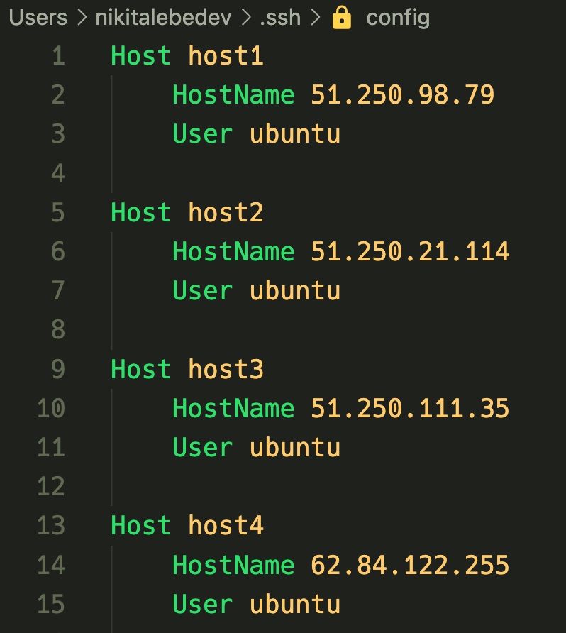

1. Убедиться, что существуют ключи ~/.ssh/id_rsa и ~/.ssh/id_rsa.pub .  
Если не существует, то создать: 
```bash
# В ответ на все вопросы жать Enter
ssh-keygen
```
2. Убедиться, что ко всем хостам можно подключиться через ssh по ключу id_rsa.
Если невозможно, то прокинуть ключ id_rsa.pub на хосты:
```bash
ssh-copy-id ubuntu@host1
ssh-copy-id ubuntu@host2
ssh-copy-id ubuntu@host3
ssh-copy-id ubuntu@host4
```
3. Прописать хосты в ~/.ssh/config

